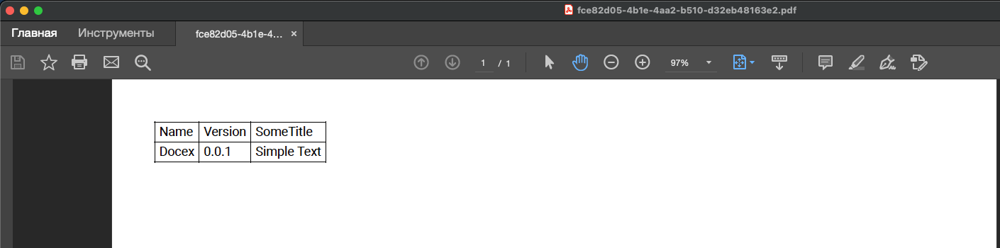
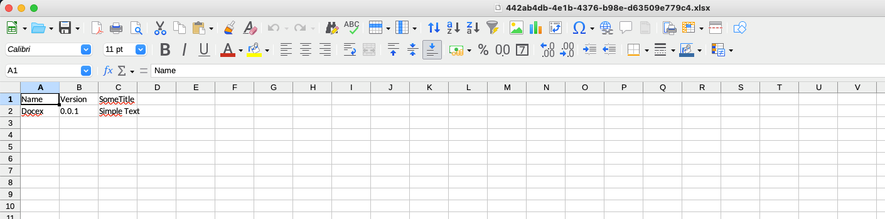

<p align="center">
  <b>Docex</b> is a Node.js ❤️ middleware that is used to implement the export of endpoint execution results to PDF or XLSX using the openapi documentation
</p>

## ⚙️ Installation

```bash
npm install --save @docex/middleware
```

## 💻 Usage

```javascript
const http = require('http');
const Koa = require('koa');
const Router = require('koa-router');

const docex = require('docex').default;

const app = new Koa();
const router = new Router();

router.get('/', (ctx, next) => {
    const obj = {
        name: 'Docex',
        version: '0.0.1'
    };
    ctx.body = obj;

    return obj;
});

app.use(docex({
    openapiPath: './openapi.yaml',
    savePath: './docs'
}));

app.use(router.routes());
app.use(router.allowedMethods());

module.exports = http.createServer(app.callback()).listen(3000);
```

```yaml
openapi: 3.0.0
info:
  # ...
paths:
  /:
    get:
      summary: Simple endpoint
      responses:
        '200':
          description: Test
          content:
            application/json:
              schema:
                $ref: '#/components/schemas/Test'
components:
  schemas:
    Test:
      type: object
      properties:
        name:
          title: 'Name'
        version:
          title: 'Version'
```





